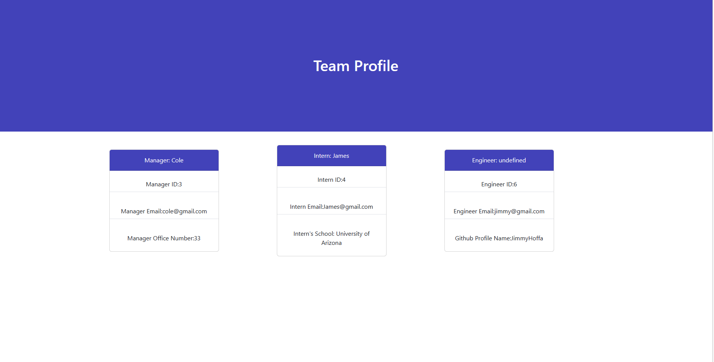

# Profile-Generator
This application will use Object Oriented Programming as well as node.js and will be running some code tests in order to create a custom logo based on parameters given.

## Application
To run this application, you will want to downlaod the files and open your integrated Terminal for the project. Next you want to enter "node index" into the command prompt. This will trigger a series of prompts that you will want to answer accordingly. After these prompts are answered a team profile will be created that gives you the layout in cards with bootstrap styling. 

### Screenshot and screen recording 
[label](dist/generateHTML.js%20-%20Logo-Generator%20-%20Visual%20Studio%20Code%202023-03-08%2014-20-03.mp4)

